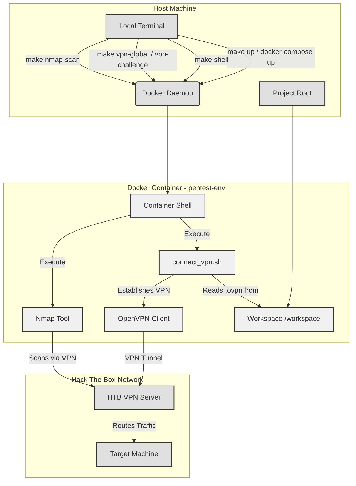

```mermaid
architecture-beta
    group host(mdi:laptop)[Host Machine]
    group docker(mdi:docker)[Docker Container pentest_env] in host
    group htb(mdi:cloud)[Hack The Box Network]

    service terminal(mdi:terminal)[Local Terminal] in host
    service docker_daemon(mdi:server)[Docker Daemon] in host
    service project_root(mdi:folder-file)[Project Root] in host

    service shell(mdi:terminal)[Container Shell] in docker
    service connect_vpn(mdi:script)[Connect VPN] in docker
    service openvpn(mdi:server)[OpenVPN Client] in docker
    service nmap(mdi:script)[Nmap Scan] in docker
    service workspace(mdi:folder-file)[workspace] in docker

    service vpn_server(mdi:vpn)[HTB VPN Server] in htb
    service target(mdi:server)[Target Machine] in htb

    terminal:R -- L:docker_daemon
    docker_daemon:R -- L:shell

    shell:R -- L:connect_vpn
    shell:T -- L:nmap

    project_root:R -- L:workspace

    connect_vpn:R -- L:openvpn
    connect_vpn:B -- T:workspace

    nmap:R -- L:vpn_server
    openvpn:R -- L:vpn_server
    vpn_server:R -- L:target
```

# Docker and VPN Architecture

This document details the architecture of the Docker environment and the VPN connection within the HTB-Challenge-Toolkit.

## 1. Docker Environment Overview

The HTB-Challenge-Toolkit leverages Docker to provide a consistent and isolated penetration testing environment.

-   **`docker/Dockerfile`**: This file defines the `pentest-env` Docker image. It's based on `mcr.microsoft.com/vscode/devcontainers/base:debian`, ensuring a familiar Debian-based environment. Essential tools like `openvpn`, `nmap`, `procps`, `net-tools`, and `iputils-ping` are installed here. The `connect_vpn.sh` script is copied into the image, making it available within the container.

-   **`docker/docker-compose.yml`**: This file orchestrates the Docker services. It defines a single service, `pentest-env`, which uses the image built from the `Dockerfile`.
    -   **Volume Mount (`..:/workspace:cached`)**: This critical configuration mounts the entire project root directory from the host machine into the `/workspace` directory inside the container. This ensures that all project files, including challenge writeups, `.ovpn` files, and scan results, are directly accessible and synchronized between the host and the container.
    -   **Network**: The container operates within a Docker network, allowing it to communicate with the host and, once the VPN is established, with external Hack The Box machines.

## 2. VPN Connection Flow

The VPN connection is established manually by the user, providing explicit control over the process.

1.  **Initiation**: The user executes the `connect_vpn.sh` script from within the `pentest-env` container. This can be done directly from the container's shell (if using a Dev Container) or via `docker exec` from the host terminal (often simplified by `make vpn-global` or `make vpn-challenge`).
2.  **`.ovpn` File Location**: The `connect_vpn.sh` script intelligently locates the `.ovpn` configuration file based on a priority order:
    *   An explicit path provided as an argument (e.g., `challenges/my_challenge/my_challenge.ovpn`).
    *   If no argument, it defaults to `/workspace/global.ovpn` for a general VPN connection.
3.  **OpenVPN Client**: The script then uses the `openvpn` client within the container to establish the connection to the Hack The Box VPN server using the specified `.ovpn` file.
4.  **Network Routing**: Once connected, the container's network routing is updated to direct traffic for the VPN network (e.g., 10.10.10.0/24) through the VPN tunnel.

### VPN Connection Diagram

#### Simplified Diagram

#### Detailed Diagram

## 3. Volume Mounts and File Access

The core of the seamless integration between the host and the container is the volume mount configured in `docker-compose.yml`: `..:/workspace:cached`.

-   **Host Side (`..`)**: This refers to the parent directory of the `docker/` folder, which is the project root (`/home/aretw0/htb/cap/`).
-   **Container Side (`/workspace`)**: This is the directory inside the `pentest-env` container where the host's project root is mounted.
-   **`cached` option**: This optimizes performance by caching changes, which is beneficial for frequently accessed files.

This setup ensures that:
-   Any `.ovpn` files (e.g., `global.ovpn`, `challenges/cap/cap.ovpn`) placed in the project root or its subdirectories on the host are immediately available inside the container at `/workspace/<path_to_file>`.
-   Scan results generated by `nmap_scan.sh` (which defaults to `scans/` or a specified path relative to `/workspace`) are written directly to the host's filesystem, making them persistent and easily accessible outside the container.
-   All other project files, including `WRITEUP.md` templates and challenge-specific notes, are synchronized.

## 4. Tooling and Script Execution

All primary penetration testing tools (like Nmap) and custom utility scripts (`connect_vpn.sh`, `nmap_scan.sh`) are designed to be executed from within the `pentest-env` container.

-   **Direct Execution (inside Dev Container)**: If working within a VS Code Dev Container, the user is already in the container's shell. Scripts can be executed directly by their path, e.g., `/workspace/tools/nmap_scan.sh <IP_ADDRESS>`.
-   **Via `docker exec` (from Host Terminal)**: For users working from their host terminal, commands are typically run using `docker exec -it docker_pentest-env_1 <command>`.
-   **Via `Makefile` (from Host Terminal)**: The `Makefile` simplifies these `docker exec` commands into convenient `make` targets (e.g., `make nmap-scan IP=...`). The `Makefile` handles the `docker exec` part, abstracting it away from the user.

This approach ensures that all operations are performed in the consistent and pre-configured environment, avoiding local machine dependency issues.