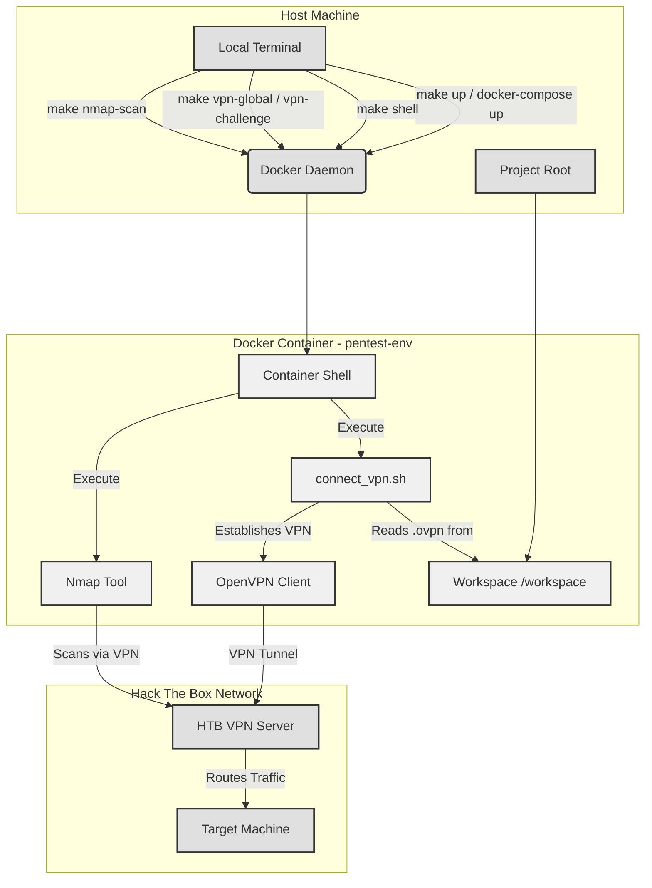

# Arquitetura Docker e VPN

Este documento detalha a arquitetura do ambiente Docker e a conexão VPN dentro do HTB-Challenge-Toolkit.

## 1. Visão Geral do Ambiente Docker

O HTB-Challenge-Toolkit utiliza o Docker para fornecer um ambiente de teste de penetração consistente e isolado.

-   **`docker/Dockerfile`**: Este arquivo define a imagem Docker `pentest-env`. É baseada em `mcr.microsoft.com/vscode/devcontainers/base:debian`, garantindo um ambiente familiar baseado em Debian. Ferramentas essenciais como `openvpn`, `nmap`, `procps`, `net-tools` e `iputils-ping` são instaladas aqui. O script `connect_vpn.sh` é copiado para a imagem, tornando-o disponível dentro do contêiner.

-   **`docker/docker-compose.yml`**: Este arquivo orquestra os serviços Docker. Ele define um único serviço, `pentest-env`, que usa a imagem construída a partir do `Dockerfile`.
    -   **Montagem de Volume (`..:/workspace:cached`)**: Esta configuração crítica monta todo o diretório raiz do projeto da máquina host no diretório `/workspace` dentro do contêiner. Isso garante que todos os arquivos do projeto, incluindo writeups de desafios, arquivos `.ovpn` e resultados de varredura, estejam diretamente acessíveis e sincronizados entre o host e o contêiner.
    -   **Rede**: O contêiner opera dentro de uma rede Docker, permitindo que ele se comunique com o host e, uma vez que a VPN seja estabelecida, com máquinas externas do Hack The Box.

## 2. Fluxo de Conexão VPN

A conexão VPN é estabelecida manualmente pelo usuário, proporcionando controle explícito sobre o processo.

1.  **Iniciação**: O usuário executa o script `connect_vpn.sh` de dentro do contêiner `pentest-env`. Isso pode ser feito diretamente do shell do contêiner (se estiver usando um Dev Container) ou via `docker exec` do terminal do host (muitas vezes simplificado por `make vpn-global` ou `make vpn-challenge`).
2.  **Localização do Arquivo `.ovpn`**: O script `connect_vpn.sh` localiza inteligentemente o arquivo de configuração `.ovpn` com base em uma ordem de prioridade:
    *   Um caminho explícito fornecido como argumento (ex: `challenges/my_challenge/my_challenge.ovpn`).
    *   Se nenhum argumento for fornecido, ele assume `/workspace/global.ovpn` para uma conexão VPN geral.
3.  **Cliente OpenVPN**: O script então usa o cliente `openvpn` dentro do contêiner para estabelecer a conexão com o servidor VPN do Hack The Box usando o arquivo `.ovpn` especificado.
4.  **Roteamento de Rede**: Uma vez conectado, o roteamento de rede do contêiner é atualizado para direcionar o tráfego para a rede VPN (ex: 10.10.10.0/24) através do túnel VPN.

### Diagrama de Conexão VPN

#### Diagrama Simplificado

```mermaid
architecture-beta
    group host(mdi:laptop)[Host Machine]
    group docker(mdi:docker)[Docker Container pentest_env] in host
    group htb(mdi:cloud)[Hack The Box Network]

    service terminal(mdi:terminal)[Local Terminal] in host
    service docker_daemon(mdi:server)[Docker Daemon] in host
    service project_root(mdi:folder-file)[Project Root] in host

    service shell(mdi:terminal)[Container Shell] in docker
    service connect_vpn(mdi:script)[Connect VPN] in docker
    service openvpn(mdi:server)[OpenVPN Client] in docker
    service nmap(mdi:script)[Nmap Scan] in docker
    service workspace(mdi:folder-file)[workspace] in docker

    service vpn_server(mdi:vpn)[HTB VPN Server] in htb
    service target(mdi:server)[Target Machine] in htb

    terminal:R -- L:docker_daemon
    docker_daemon:R -- L:shell

    shell:R -- L:connect_vpn
    shell:T -- L:nmap

    project_root:R -- L:workspace

    connect_vpn:R -- L:openvpn
    connect_vpn:B -- T:workspace

    nmap:R -- L:vpn_server
    openvpn:R -- L:vpn_server
    vpn_server:R -- L:target
```

#### Diagrama Detalhado

## 3. Montagens de Volume e Acesso a Arquivos

O cerne da integração perfeita entre o host e o contêiner é a montagem de volume configurada em `docker-compose.yml`: `..:/workspace:cached`.

-   **Lado do Host (`..`)**: Isso se refere ao diretório pai da pasta `docker/`, que é a raiz do projeto (`/home/aretw0/htb/cap/`).
-   **Lado do Contêiner (`/workspace`)**: Este é o diretório dentro do contêiner `pentest-env` onde a raiz do projeto do host é montada.
-   **Opção `cached`**: Isso otimiza o desempenho armazenando em cache as alterações, o que é benéfico para arquivos acessados com frequência.

Esta configuração garante que:
-   Quaisquer arquivos `.ovpn` (ex: `global.ovpn`, `challenges/cap/cap.ovpn`) colocados na raiz do projeto ou em seus subdiretórios no host estejam imediatamente disponíveis dentro do contêiner em `/workspace/<caminho_do_arquivo>`.
-   Os resultados de varredura gerados por `nmap_scan.sh` (que assume `scans/` por padrão ou um caminho especificado em relação a `/workspace`) sejam gravados diretamente no sistema de arquivos do host, tornando-os persistentes e facilmente acessíveis fora do contêiner.
-   Todos os outros arquivos do projeto, incluindo modelos `WRITEUP.md` e notas específicas do desafio, sejam sincronizados.

## 4. Ferramentas e Execução de Scripts

Todas as ferramentas primárias de teste de penetração (como Nmap) e scripts utilitários personalizados (`connect_vpn.sh`, `nmap_scan.sh`) são projetados para serem executados de dentro do contêiner `pentest-env`.

-   **Execução Direta (dentro do Dev Container)**: Se estiver trabalhando em um VS Code Dev Container, o usuário já estará no shell do contêiner. Os scripts podem ser executados diretamente pelo seu caminho, ex: `/workspace/tools/nmap_scan.sh <ENDEREÇO_IP>`.
-   **Via `docker exec` (do Terminal do Host)**: Para usuários que trabalham a partir do terminal do host, os comandos são tipicamente executados usando `docker exec -it docker_pentest-env_1 <comando>`.
-   **Via `Makefile` (do Terminal do Host)**: O `Makefile` simplifica esses comandos `docker exec` em alvos `make` convenientes (ex: `make nmap-scan IP=...`). O `Makefile` lida com a parte `docker exec`, abstraindo-a do usuário.

Esta abordagem garante que todas as operações sejam realizadas no ambiente consistente e pré-configurado, evitando problemas de dependência da máquina local.
